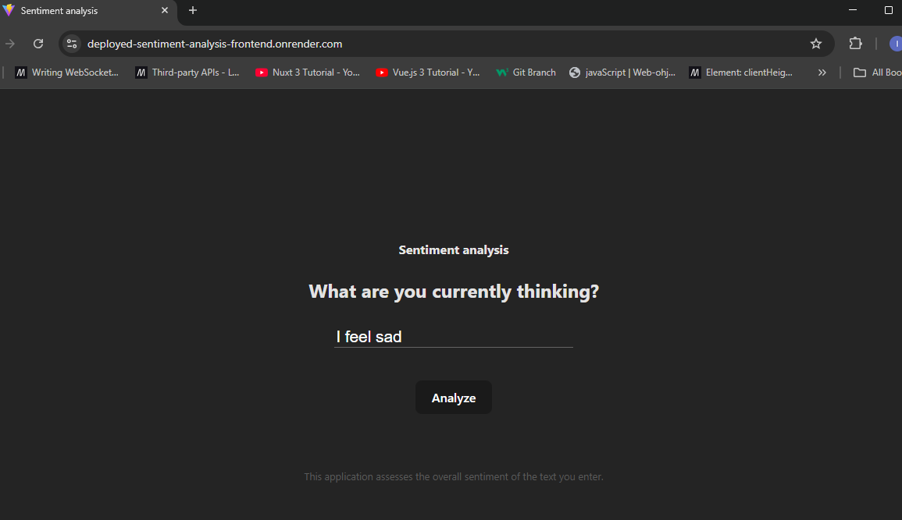
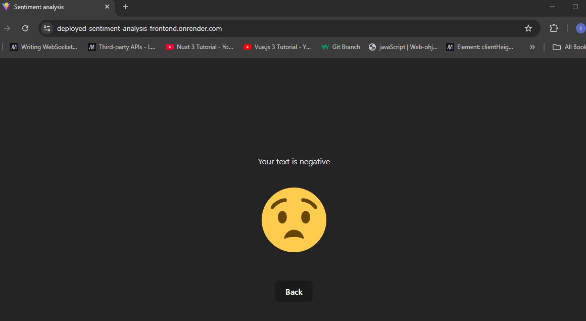

# Tehtävät 3 & 5
Tämä projekti pitää sisällään Reactilla toteutetun yksinkertaisen mobiiliresponsiivisen tunneanalyysi-frontendin.

Sovellus hakee tunnenanalyysin tuloksen frontendia varten luodusta backendista, joka palauttaa vastauksen NLP-koulutusmallin tuottamaan tunneanalyysiin perustuen.

## Tehtävä 3, osa 2/2 - Frontend-ratkaisun käyttö build pipelinella Renderin kautta
Renderin kautta julkaistu sovellus löytyy osoitteesta https://deployed-sentiment-analysis-frontend.onrender.com/.

### Esimerkki käyttöönotetun sovelluksen toiminnasta




## Tehtävä 5, osa 2/2 - Frontend-ratkaisun käyttö build pipelinella Azuren kautta
Azuren kautta julkaistu sovellus löytyy osoitteesta https://kind-forest-04e83171e.6.azurestaticapps.net/.

Frontendille on tehty myös Dockerfile ja compose.yaml paikallista ajoa ja kehitystä varten sekä muiden pilvipalveluiden kautta myöhemmin mahdollisesti tapahtuvaa käyttöönottoa varten.

## Projektin kloonaaminen ja konfigurointi paikallisesti
Kloonaa repositorio:
```
git clone https://github.com/inkaliinalauranto/Deployed-React-Frontend.git
```
Siirry projektikansioon:
```
cd Deployed-React-Frontend
```
Asenna riippuvuudet:
```
npm install
```
Käynnistä kehityspalvelin:
```
npm run dev
```